# Repository Maintainability Index (RMI)

> **Automatically evaluate and improve your GitHub repository quality with AI-powered insights**

[](https://github.com/JungleKIA/Repository-Maintainability-Index/actions)
[](https://opensource.org/licenses/MIT)
[](https://adoptium.net/)
[](docs/TESTING_VERIFICATION.md)

## 🎯 What is RMI?

**Repository Maintainability Index (RMI)** is a command-line tool that analyzes GitHub repositories and gives them a quality score (0-100) based on 6 key metrics. Think of it as a "health check" for your repository.

### Why Use RMI?

- 📊 **Instant Quality Score** - Get a comprehensive 0-100 score in seconds
- 🤖 **AI-Powered Insights** - Optional LLM analysis provides actionable recommendations
- 📈 **Track Improvements** - Measure progress as you improve your repository
- 🎯 **Actionable Recommendations** - Know exactly what to fix and why
- 🚀 **Easy to Use** - Single command, clear output, no configuration needed

### What Does It Measure?

| Metric | What It Checks | Why It Matters |
|--------|----------------|----------------|
| 📚 **Documentation** (20%) | README, LICENSE, CONTRIBUTING, CODE_OF_CONDUCT, CHANGELOG | Good docs = easier onboarding |
| 🎫 **Issue Management** (20%) | Issue closure rate, open issues | Shows project responsiveness |
| ✍️ **Commit Quality** (15%) | Conventional commit messages | Clean history = easier debugging |
| ⚡ **Activity** (15%) | Recent commits, freshness | Active projects = maintained code |
| 👥 **Community** (15%) | Stars, forks, contributors | Popular = trusted |
| 🌿 **Branch Management** (15%) | Number of branches | Fewer branches = cleaner workflow |

### Real Example

```bash
$ java -jar rmi.jar analyze microsoft/vscode

╔═══════════════════════════════════════════════════════════════╗
║        📊 Repository Maintainability Index Report            ║
╠═══════════════════════════════════════════════════════════════╣

📁 Repository: microsoft/vscode
🎯 Overall Score: 94.20/100 [████████████████████░] ⭐ EXCELLENT

📈 Detailed Metrics:
  📚 Documentation:     100/100 🟢 (weight: 20%)
  ✍️ Commit Quality:     90/100 🟢 (weight: 15%)
  ⚡ Activity:           98/100 🟢 (weight: 15%)
  👥 Community:          95/100 🟢 (weight: 15%)
  🎫 Issue Management:   88/100 🟡 (weight: 20%)
  🌿 Branch Management:  92/100 🟢 (weight: 15%)

💡 Recommendations:
  🥇 Excellent repository! Keep up the outstanding work.
╚═══════════════════════════════════════════════════════════════╝
```

## 🚀 Quick Start (3 Steps, 2 Minutes)

### Step 1: Check Prerequisites

```bash
# Check if you have Java 17+
java -version

# ✅ Should show: "openjdk version 17" or higher
# ❌ If not installed: Download from https://adoptium.net/
```

### Step 2: Download RMI

**Option A: Download Pre-built JAR (Easiest)**
```bash
# Download latest release
curl -L https://github.com/JungleKIA/Repository-Maintainability-Index/releases/latest/download/repo-maintainability-index-1.0.1.jar -o rmi.jar

# Or download manually from: https://github.com/JungleKIA/Repository-Maintainability-Index/releases
```

**Option B: Build from Source (For Developers)**
```bash
git clone https://github.com/JungleKIA/Repository-Maintainability-Index.git
cd Repository-Maintainability-Index
mvn clean package
# JAR will be in target/ directory
```

### Step 3: Run Your First Analysis

```bash
# Analyze any public GitHub repository
java -jar rmi.jar analyze facebook/react

# That's it! You'll see a detailed quality report in seconds.
```

### 🎯 Next Steps

**Want AI-powered insights?** Add the `--llm` flag:
```bash
# Set your OpenRouter API key (get free key at https://openrouter.ai/)
export OPENROUTER_API_KEY=your_key_here

# Run with AI analysis
java -jar rmi.jar analyze facebook/react --llm
```

**Need JSON output for automation?**
```bash
java -jar rmi.jar analyze facebook/react --format json
```

**Analyzing private repositories?**
```bash
# Get GitHub token from: https://github.com/settings/tokens
export GITHUB_TOKEN=your_token_here
java -jar rmi.jar analyze your-org/private-repo
```

> 💡 **Tip**: See [QUICK_START.md](QUICK_START.md) for detailed setup guide with screenshots and troubleshooting.

## 💼 Use Cases

### For Open Source Maintainers
- 📊 **Track project health** - Monitor your repository quality over time
- 🎯 **Prioritize improvements** - Know what to fix first based on impact
- 📈 **Show project quality** - Display your score as a badge in README

### For Development Teams
- ✅ **Code review checklist** - Ensure PRs meet quality standards
- 📋 **Onboarding tool** - Help new team members understand project standards
- 🔍 **Repository audit** - Evaluate multiple repos across your organization

### For Developers
- 🔎 **Evaluate dependencies** - Check quality before adding a dependency
- 📚 **Learn best practices** - See what makes a high-quality repository
- 🏆 **Improve your projects** - Get actionable recommendations

### For Hiring Managers
- 💼 **Evaluate candidates** - Check quality of candidate's GitHub projects
- 🎯 **Portfolio assessment** - Objective metrics for code portfolio review

## 🤝 Contributing

We welcome contributions! Here's how you can help improve RMI:

### Ways to Contribute
- **📋 Report Issues** - Found a bug? Open an issue with detailed steps to reproduce
- **💡 Suggest Features** - Have ideas for new metrics or improvements?
- **🔧 Submit PRs** - Want to add features or fix bugs?
- **📚 Improve Documentation** - Help make our docs clearer
- **📝 Add Tests** - Increase our test coverage

### Development Setup
```bash
# 1. Fork and clone the repository
git clone https://github.com/your-username/Repository-Maintainability-Index.git
cd Repository-Maintainability-Index

# 2. Build the project
mvn clean package

# 3. Run tests
mvn test

# 4. Run analysis on test repo
java -jar target/repo-maintainability-index-1.0.1.jar analyze picocli/picocli
```

### Pull Request Process
1. Create a feature branch: `git checkout -b feature/your-feature-name`
2. Make your changes with good commit messages
3. Ensure all tests pass: `mvn test`
4. Update documentation if needed
5. Submit a pull request with a clear description

### Code Standards
- Java 17+ compatible
- Comprehensive test coverage (90% target)
- Document all public APIs
- Follow existing code patterns

### Testing Guidelines
- Unit tests for all new functionality
- Integration tests for API features
- Test edge cases and error conditions
- Verify LLM integration works correctly

---

## 📄 License

**MIT License**

Copyright (c) 2024 Repository Maintainability Index (Kaicode Festival)

Permission is hereby granted, free of charge, to any person obtaining a copy
of this software and associated documentation files (the "Software"), to deal
in the Software without restriction, including without limitation the rights
to use, copy, modify, merge, publish, distribute, sublicense, and/or sell
copies of the Software, and to permit persons to whom the Software is
furnished to do so, subject to the following conditions:

The above copyright notice and this permission notice shall be included in all
copies or substantial portions of the Software.

THE SOFTWARE IS PROVIDED "AS IS", WITHOUT WARRANTY OF ANY KIND, EXPRESS OR
IMPLIED, INCLUDING BUT NOT LIMITED TO THE WARRANTIES OF MERCHANTABILITY,
FITNESS FOR A PARTICULAR PURPOSE AND NONINFRINGEMENT. IN NO EVENT SHALL THE
AUTHORS OR COPYRIGHT HOLDERS BE LIABLE FOR ANY CLAIM, DAMAGES OR OTHER
LIABILITY, WHETHER IN AN ACTION OF CONTRACT, TORT OR OTHERWISE, ARISING FROM,
OUT OF OR IN CONNECTION WITH THE SOFTWARE OR THE USE OR OTHER DEALINGS IN THE
SOFTWARE.

---

> **🚀 Quick Start**: New to RMI? Check out [QUICK_START.md](QUICK_START.md) for a complete step-by-step guide!

> **📊 Self-Analysis**: This repository practices what it preaches! Check [docs/REPOSITORY_IMPROVEMENT_SUMMARY.md](docs/REPOSITORY_IMPROVEMENT_SUMMARY.md) to see how we improved our own score from 53.45/100 to 69.45/100+ by following our tool's recommendations.

## 📊 How It Works

### Simple 3-Step Process

```mermaid
graph LR
    A[🔍 Fetch Repository Data] --> B[📊 Calculate 6 Metrics]
    B --> C[🤖 Optional: AI Analysis]
    C --> D[📈 Generate Report]
    D --> E[💡 Actionable Recommendations]
```



1. **Fetch Data** - Connects to GitHub API and retrieves repository information
2. **Calculate Metrics** - Analyzes 6 key quality indicators with weighted scoring
3. **AI Analysis** (Optional) - LLM evaluates README, commits, and community health
4. **Generate Report** - Creates human-readable or JSON output
5. **Recommendations** - Provides prioritized suggestions for improvement

### Real-World Comparison

| Repository | Score | Rating | Key Issues |
|------------|-------|--------|------------|
| microsoft/vscode | 94.2/100 | ⭐ EXCELLENT | None - well maintained |
| facebook/react | 87.5/100 | ✅ GOOD | Could improve branch management |
| small-project/demo | 45.3/100 | ❌ POOR | Missing docs, inactive, no community |

### What Makes a High-Quality Repository?

**Excellent (90-100)**: Complete documentation, active maintenance, strong community, clean commit history
**Good (75-89)**: Most best practices followed, minor improvements needed
**Fair (60-74)**: Some quality issues, needs attention in 2-3 areas
**Poor (<60)**: Multiple critical issues, requires significant improvement

## Overview

The Repository Maintainability Index tool analyzes GitHub repositories and provides a comprehensive assessment of their quality based on multiple metrics including documentation, commit quality, activity, issue management, community engagement, and branch management.

## Features

- **Comprehensive Metrics**: Evaluates 6 key aspects of repository maintainability
- **Weighted Scoring**: Each metric has an appropriate weight reflecting its importance
- **🤖 AI-Powered Analysis**: Optional LLM integration for deep insights into README quality, commit patterns, and community health
- **Smart Recommendations**: AI-generated actionable recommendations with impact and confidence scores
- **Multiple Output Formats**: Supports both human-readable text and JSON formats
- **GitHub API Integration**: Fetches real-time data from GitHub
- **Production-Ready**: 90%+ test coverage with best practices
- **📚 Complete Documentation**: Full suite of documentation (CONTRIBUTING.md, CODE_OF_CONDUCT.md, LICENSE, CHANGELOG.md)
- **🚀 Quiet Mode**: `--quiet` flag suppresses progress logs while showing analysis results (perfect for scripting)

## Metrics

| Metric | Weight | Description |
|--------|--------|-------------|
| Documentation | 20% | Presence of README, LICENSE, CONTRIBUTING, CODE_OF_CONDUCT, CHANGELOG |
| Issue Management | 20% | Issue closure rate and open issue count |
| Commit Quality | 15% | Adherence to commit message conventions |
| Activity | 15% | Repository freshness based on recent commits |
| Community | 15% | Stars, forks, and contributor count |
| Branch Management | 15% | Number of branches (fewer is better) |

## Installation

### Prerequisites

- Java 17 or higher
- Maven 3.6 or higher

### Build from Source

```bash
git clone <repository-url>
cd repo-maintainability-index
mvn clean package
```

This will create an executable JAR file in the `target/` directory.

## 🐳 Docker Installation

For enterprise deployments, containerized installation is the preferred method.

### Prerequisites

- Docker Engine 20.10 or higher
- Docker Compose Plugin (optional, for multi-container setup)

### Option 1: Build from Source

```bash
# Clone and build Docker image
git clone <repository-url>
cd repo-maintainability-index

# Build Docker image
docker build -t rmi-app .

# Run container
docker run --rm -e GITHUB_TOKEN=your_token rmi-app analyze owner/repo
```

### Option 2: Use Pre-built Image (Recommended)

When available on GitHub Container Registry:

```bash
# Pull latest image
docker pull ghcr.io/junglekia/repository-maintainability-index:latest

# Run analysis
docker run --rm \
  -e GITHUB_TOKEN=your_token \
  -e OPENROUTER_API_KEY=your_llm_key \
  ghcr.io/junglekia/repository-maintainability-index:latest \
  analyze owner/repo --llm
```

### Option 3: Docker Compose (Development/Testing)

```bash
# Start with compose (includes volume mounts)
docker-compose up -d rmi

# Run analysis
docker-compose exec rmi analyze owner/repo --llm
```

### Environment Configuration for Docker

Create a `.env` file:

```bash
GITHUB_TOKEN=your_github_token_here
OPENROUTER_API_KEY=your_llm_key_here
LOG_LEVEL=INFO
```

Run with environment file:
```bash
docker run --rm --env-file .env rmi-app analyze owner/repo --llm
```

### Docker Launcher Scripts

Use provided scripts for easy Docker deployment:

```bash
# Build and run
./run-docker.sh build
./run-docker.sh run analyze owner/repo --llm

# Or directly
./run-docker.sh analyze owner/repo --llm
```

### Production Deployment

For production, use:

```yaml
# Kubernetes deployment
apiVersion: apps/v1
kind: Deployment
metadata:
  name: rmi-application
spec:
  replicas: 1
  selector:
    matchLabels:
      app: rmi
  template:
    metadata:
      labels:
        app: rmi
    spec:
      containers:
      - name: rmi
        image: ghcr.io/junglekia/repository-maintainability-index:latest
        env:
        - name: GITHUB_TOKEN
          valueFrom:
            secretKeyRef:
              name: rmi-secrets
              key: github-token
        ports:
        - containerPort: 8080
        securityContext:
          runAsNonRoot: true
          allowPrivilegeEscalation: false
```

### Docker Image Features

- ✅ **Multi-stage build** - Optimized image size
- ✅ **Security hardened** - Non-root user, minimal image
- ✅ **Health checks** - Automatic container monitoring
- ✅ **Resource limits** - CPU/memory constraints
- ✅ **UTF-8 support** - Proper Unicode handling
- ✅ **ARM64/AMD64** - Multi-platform support

## Environment Configuration

The application supports configuration via environment variables. You can set them directly or use a `.env` file in the project root.

### Environment Variables

| Variable | Description | Default | Required |
|----------|-------------|---------|----------|
| `GITHUB_TOKEN` | GitHub personal access token for higher API rate limits | None | Recommended |
| `OPENROUTER_API_KEY` | API key for OpenRouter LLM service | None | Required for LLM features |
| `OPENROUTER_MODEL` | LLM model to use for analysis | `openai/gpt-oss-20b:free` | Optional |
| `OPENAI_API_BASE` | OpenRouter API base URL | `https://openrouter.ai/api/v1` | Optional |

### Using .env File

Create a `.env` file in the project root:

```bash
# GitHub API token for authentication
# Get your token from: https://github.com/settings/tokens
# Required scopes: public_repo, repo:status
GITHUB_TOKEN=your_github_token_here

OPENROUTER_API_KEY=your_openrouter_api_key_here

# Optional: Custom model
OPENROUTER_MODEL=openai/gpt-oss-20b:free

# Optional: Custom API base (usually not needed)
OPENAI_API_BASE=https://openrouter.ai/api/v1
```

**⚠️ Security Warning:** Never commit `.env` files to version control. The project `.gitignore` already excludes `.env` files.

### Alternative: Set Environment Variables Directly

```bash
export GITHUB_TOKEN=your_github_token_here
export OPENROUTER_API_KEY=your_openrouter_api_key_here
```

## Usage

### 🪟 Windows & GitBash: Unicode/UTF-8 Support

**IMPORTANT**: For proper Unicode display (box-drawing characters like ═, ─, │, ┌, ┐, └, ┘), you **MUST** use one of these methods:

> **Why?** Java requires `-Dfile.encoding=UTF-8` to be set at JVM startup. This cannot be changed after the JVM starts. Additionally, Git Bash on Windows needs `chcp 65001` to display Unicode correctly.

#### ✅ Method 1: Use the provided launcher scripts (RECOMMENDED)

```bash
# Windows - Quick launcher
rmi.bat analyze owner/repo

# Windows - Full-featured launcher  
run-with-encoding.bat analyze owner/repo --llm

# Linux / macOS / Git Bash
./run-with-encoding.sh analyze owner/repo --llm
```

#### ✅ Method 2: Add `-Dfile.encoding=UTF-8` flag

```bash
# Windows Command Prompt
chcp 65001
java -Dfile.encoding=UTF-8 -jar target/repo-maintainability-index-1.0.0.jar analyze owner/repo

# Git Bash
export LANG=en_US.UTF-8
java -Dfile.encoding=UTF-8 -jar target/repo-maintainability-index-1.0.0.jar analyze owner/repo

# PowerShell
[Console]::OutputEncoding = [System.Text.Encoding]::UTF8
java -Dfile.encoding=UTF-8 -jar target/repo-maintainability-index-1.0.0.jar analyze owner/repo
```

**Why is this needed?** Java requires the `-Dfile.encoding=UTF-8` flag to be set at JVM startup for proper Unicode handling. The application cannot change this after the JVM has started. The provided scripts handle this automatically.

**❌ This will NOT work correctly:**
```bash
java -jar target/repo-maintainability-index-1.0.0.jar analyze owner/repo
# You'll see garbled characters like 'ΓòÉ' instead of '═'
```

**💡 Tip**: To avoid typing the flag every time, you can configure Git Bash to always use UTF-8:

**Quick setup (automatic):**
```bash
./setup-gitbash-utf8.sh
```

**Manual setup:** See [GITBASH_UTF8_SETUP.md](GITBASH_UTF8_SETUP.md) for detailed instructions.

### Basic Usage

**⚠️ IMPORTANT**: Always use `-Dfile.encoding=UTF-8` for proper Unicode display:

```bash
java -Dfile.encoding=UTF-8 -jar target/repo-maintainability-index-1.0.0.jar analyze owner/repo
```

Or use the quick launcher script:
```bash
rmi.bat analyze owner/repo
```

### With GitHub Token (Recommended)

To avoid rate limiting, use a GitHub personal access token. You can set it via environment variable or command line:

```bash
# Via environment variable (recommended) - DON'T FORGET -Dfile.encoding=UTF-8!
GITHUB_TOKEN=your_token java -Dfile.encoding=UTF-8 -jar target/repo-maintainability-index-1.0.0.jar analyze owner/repo

# Via command line parameter
java -Dfile.encoding=UTF-8 -jar target/repo-maintainability-index-1.0.0.jar analyze owner/repo --token YOUR_GITHUB_TOKEN

# Or use the script (handles encoding automatically)
rmi.bat analyze owner/repo --token YOUR_GITHUB_TOKEN
```

See [Environment Configuration](#environment-configuration) for details on setting up `.env` files.

### With AI Analysis (LLM)

Enable AI-powered deep analysis with LLM integration. Set your OpenRouter API key via environment variable or `.env` file:

```bash
# Using environment variable - DON'T FORGET -Dfile.encoding=UTF-8!
OPENROUTER_API_KEY=your_api_key_here java -Dfile.encoding=UTF-8 -jar target/repo-maintainability-index-1.0.0.jar analyze owner/repo --llm

# Or set OPENROUTER_API_KEY in your .env file and use the script
rmi.bat analyze owner/repo --llm
```

This provides:
- 📖 **README Analysis**: Clarity, completeness, and newcomer-friendliness scores
- 📝 **Commit Quality**: Analysis of commit message patterns and consistency
- 👥 **Community Health**: Responsiveness, helpfulness, and tone evaluation
- 💡 **AI Recommendations**: Prioritized suggestions with impact and confidence scores

⚠️ **Security Note**: OpenRouter automatically disables API keys exposed in public repositories. Always use environment variables or `.env` files (never commit them to git). See [Environment Configuration](#environment-configuration) and [SECURITY_BEST_PRACTICES.md](SECURITY_BEST_PRACTICES.md) for proper usage.

You can specify a custom model via environment variable or command line:

```bash
# Via environment variable
OPENROUTER_MODEL=openai/gpt-4 java -Dfile.encoding=UTF-8 -jar target/repo-maintainability-index-1.0.0.jar analyze owner/repo --llm

# Via command line parameter (overrides environment variable)
java -Dfile.encoding=UTF-8 -jar target/repo-maintainability-index-1.0.0.jar analyze owner/repo --llm --model openai/gpt-4

# Or use the script
rmi.bat analyze owner/repo --llm --model openai/gpt-4
```

### Quiet Mode (Scripting)

For automation and scripting, use `--quiet` to suppress progress logs while keeping analysis results:

```bash
# Quiet mode - only shows final analysis, no logs
java -Dfile.encoding=UTF-8 -jar target/repo-maintainability-index-1.0.0.jar analyze owner/repo --quiet

# With LLM analysis in quiet mode
java -Dfile.encoding=UTF-8 -jar target/repo-maintainability-index-1.0.0.jar analyze owner/repo --llm --quiet
```

### JSON Output

```bash
java -Dfile.encoding=UTF-8 -jar target/repo-maintainability-index-1.0.0.jar analyze owner/repo --format json
```

### Help

```bash
java -Dfile.encoding=UTF-8 -jar target/repo-maintainability-index-1.0.0.jar --help
java -Dfile.encoding=UTF-8 -jar target/repo-maintainability-index-1.0.0.jar analyze --help
```

## Example Output

```
═══════════════════════════════════════════════════════════════
  Repository Maintainability Index Report
═══════════════════════════════════════════════════════════════

Repository: facebook/react
Overall Score: 87.50/100
Rating: GOOD

───────────────────────────────────────────────────────────────
  Detailed Metrics
───────────────────────────────────────────────────────────────

▪ Documentation: 100.00/100 (weight: 20%)
  Evaluates the presence of essential documentation files
  Details: Found: README.md, CONTRIBUTING.md, LICENSE, CODE_OF_CONDUCT.md, CHANGELOG.md. Missing: none

▪ Commit Quality: 85.00/100 (weight: 15%)
  Evaluates commit message quality and conventions
  Details: Analyzed 50 commits: 42 (85.0%) follow conventions

...

───────────────────────────────────────────────────────────────
  Recommendation
───────────────────────────────────────────────────────────────

Good repository maintainability. Keep up the good work!

═══════════════════════════════════════════════════════════════
```

## Troubleshooting Unicode Display

### Problem: Garbled Characters in Git Bash/Windows

If you see garbled characters like `ΓòÉ`, `ΓöÇ`, `Γû¬` instead of box-drawing characters (`═`, `─`, `▪`), this is a Unicode encoding issue.

**The application automatically handles this**, but if you still experience issues:

#### Solution 1: Use Provided Scripts (Recommended)

```bash
# Windows
run-with-encoding.bat analyze owner/repo

# Git Bash / Linux / macOS
./run-with-encoding.sh analyze owner/repo
```

These scripts automatically configure UTF-8 encoding for your terminal.

#### Solution 2: Manual Configuration

**Git Bash:**
```bash
export LANG=en_US.UTF-8
export LC_ALL=en_US.UTF-8
java -jar target/repo-maintainability-index-1.0.0.jar analyze owner/repo
```

**Windows Command Prompt:**
```cmd
chcp 65001
java -jar target/repo-maintainability-index-1.0.0.jar analyze owner/repo
```

**PowerShell:**
```powershell
[Console]::OutputEncoding = [System.Text.Encoding]::UTF8
java -jar target/repo-maintainability-index-1.0.0.jar analyze owner/repo
```

#### Solution 3: Configure Git Bash Font

If characters still don't display correctly:

1. Right-click on Git Bash title bar → Options
2. Go to Text → Select...
3. Choose a Unicode-compatible font:
   - **Consolas** (recommended)
   - **Cascadia Code**
   - **Fira Code**
4. Click OK and restart Git Bash

### Common Issues

| Symptom | Cause | Solution |
|---------|-------|----------|
| `ΓòÉ` instead of `═` | UTF-8 bytes interpreted as Windows-1252 | Use provided scripts or set `chcp 65001` |
| Empty squares `□` | Font doesn't support Unicode | Change font to Consolas or Cascadia Code |
| Question marks `?` | Terminal doesn't support UTF-8 | Set `LANG=en_US.UTF-8` in Git Bash |
| Mixed correct/incorrect | Inconsistent encoding | Restart terminal after setting encoding |

### Verification

To verify Unicode support is working:

```bash
# Should display box-drawing characters correctly
java -jar target/repo-maintainability-index-1.0.0.jar --help
```

You should see:
- `═══` (double horizontal lines)
- `───` (single horizontal lines)  
- `▪` (bullet points)
- Emojis like 🤖 📖 💡

If you see these correctly, Unicode support is working!

## Documentation

### 📚 Essential Documentation

- **[CONTRIBUTING.md](CONTRIBUTING.md)** - How to contribute to this project
- **[CODE_OF_CONDUCT.md](CODE_OF_CONDUCT.md)** - Community standards and guidelines
- **[LICENSE](LICENSE)** - MIT License
- **[CHANGELOG.md](CHANGELOG.md)** - Version history and changes

### 📖 Additional Resources

- **[Quick Start Guide](QUICK_START.md)** - Get started in 5 minutes
- **[Security Best Practices](SECURITY_BEST_PRACTICES.md)** - Security guidelines
- **[LLM Features](LLM_FEATURES.md)** - AI-powered analysis documentation

### 🏗️ Technical Documentation

- **[Production Documentation](docs/)** - Complete production guides
  - [Production Readiness Summary](docs/PRODUCTION_READINESS_SUMMARY.md)
  - [Operations Runbook](docs/OPERATIONS_RUNBOOK.md)
  - [Deployment Guide](docs/DEPLOYMENT_GUIDE.md)
  - [API Specification](docs/API_SPECIFICATION.md)
- **[Architecture Documentation](docs/architecture/)** - System architecture
  - [C4 Architecture Diagrams](docs/architecture/C4_ARCHITECTURE.md)
  - [Architecture Decision Records (ADRs)](docs/architecture/adr/)
- **[Documentation Index](docs/INDEX.md)** - Complete documentation index

## Development

### Running Tests

```bash
mvn test
```

### Code Coverage

```bash
mvn clean test jacoco:report
```

View the coverage report at `target/site/jacoco/index.html`.

The project enforces 90% code coverage for both instructions and branches.

### Project Structure

```
src/
├── main/
│   ├── java/com/kaicode/rmi/
│   │   ├── cli/          # Command-line interface
│   │   ├── github/       # GitHub API client
│   │   ├── metrics/      # Metric calculators
│   │   ├── model/        # Data models
│   │   ├── service/      # Business logic
│   │   ├── util/         # Utilities
│   │   └── Main.java     # Application entry point
│   └── resources/
│       └── logback.xml   # Logging configuration
└── test/
    └── java/com/kaicode/rmi/
        └── ...           # Comprehensive test suite
```

## Architecture

The application follows clean architecture principles:

- **CLI Layer**: Handles command-line interface using Picocli
- **Service Layer**: Orchestrates business logic
- **Metrics Layer**: Implements individual metric calculations
- **GitHub Client**: Manages API interactions
- **Model Layer**: Defines domain objects

## Best Practices Implemented

- ✅ Builder pattern for complex objects
- ✅ Immutable models
- ✅ Dependency injection
- ✅ Interface-based design
- ✅ Comprehensive error handling
- ✅ Logging with SLF4J/Logback
- ✅ 90%+ test coverage
- ✅ Unit and integration tests
- ✅ Mock-based testing
- ✅ Parameterized tests

## Dependencies

- **Picocli**: Command-line interface framework
- **OkHttp**: HTTP client for GitHub API
- **Gson**: JSON parsing
- **SLF4J/Logback**: Logging
- **JUnit 5**: Testing framework
- **Mockito**: Mocking framework
- **AssertJ**: Fluent assertions

## License

This project is part of the Kaicode festival submission.

## Contributing

This is a festival submission project. For production use, consider:
- Adding more metrics (code quality, security, CI/CD)
- Implementing ChatGPT integration for AI-powered insights
- Adding caching for API responses
- Supporting more Git platforms (GitLab, Bitbucket)
- Creating a web interface

## ❓ Frequently Asked Questions

### General Questions

**Q: Is RMI free to use?**  
A: Yes! RMI is open source (MIT License) and completely free. The optional AI features require an OpenRouter API key, which has a free tier.

**Q: Can I analyze private repositories?**  
A: Yes, just provide a GitHub token with appropriate permissions using the `--token` flag or `GITHUB_TOKEN` environment variable.

**Q: How long does an analysis take?**  
A: Basic analysis: 5-10 seconds. With AI analysis: 30-60 seconds (depends on repository size and API response time).

**Q: Does it work with GitLab or Bitbucket?**  
A: Currently only GitHub is supported. GitLab/Bitbucket support is planned for future releases.

### Technical Questions

**Q: What data does RMI collect?**  
A: RMI only reads public repository data via GitHub API. It doesn't store or transmit any data except to the LLM service (if you use `--llm` flag).

**Q: Why do I need Java 17+?**  
A: RMI uses modern Java features for better performance and security. Java 17 is the current LTS (Long Term Support) version.

**Q: Can I run this in CI/CD?**  
A: Yes! Use `--format json` for machine-readable output and `--quiet` to suppress logs. Perfect for automated quality gates.

**Q: How accurate are the scores?**  
A: Scores are based on objective metrics (file presence, commit patterns, activity data). The AI analysis provides subjective insights based on best practices.

### Troubleshooting

**Q: I see garbled characters instead of box-drawing symbols**  
A: This is a Unicode encoding issue. Use the provided scripts (`rmi.bat` on Windows) or add `-Dfile.encoding=UTF-8` flag. See [Unicode Support](#-windows--gitbash-unicodeutf-8-support) section.

**Q: "API rate limit exceeded" error**  
A: GitHub limits unauthenticated requests to 60/hour. Provide a GitHub token to increase limit to 5000/hour.

**Q: LLM analysis fails with "401 Unauthorized"**  
A: Check that your `OPENROUTER_API_KEY` is set correctly and has not expired. Get a new key at https://openrouter.ai/

**Q: "Repository not found" error**  
A: Verify the repository exists and is public (or you have access with your token). Format should be `owner/repo`.

## 📚 Documentation

For detailed technical documentation, see:

- **[Documentation Index](docs/README.md)** - Complete documentation guide
- **[Architecture Documentation](docs/architecture/C4_ARCHITECTURE.md)** - System design with C4 diagrams
- **[Architecture Decision Records](docs/architecture/adr/README.md)** - Key architectural decisions
- **[Implementation Notes](docs/IMPLEMENTATION_NOTES.md)** - What has been implemented
- **[Modernization Roadmap](docs/MODERNIZATION_ROADMAP.md)** - Implementation status and future work
- **[Testing Documentation](docs/TESTING_VERIFICATION.md)** - Test results and verification

### Quick Documentation Guide

| What You Want | Read This |
|---------------|-----------|
| Quick start guide | This README |
| What's been implemented? | [docs/IMPLEMENTATION_NOTES.md](docs/IMPLEMENTATION_NOTES.md) |
| How is it architected? | [docs/architecture/C4_ARCHITECTURE.md](docs/architecture/C4_ARCHITECTURE.md) |
| Why was X decision made? | [docs/architecture/adr/](docs/architecture/adr/) |
| Testing and verification | [docs/TESTING_VERIFICATION.md](docs/TESTING_VERIFICATION.md) |

## Quality & Security

This project implements production-ready engineering practices:

- ✅ **90%+ Test Coverage** - Comprehensive unit and integration tests
- ✅ **Security Scanning** - OWASP Dependency-Check, Trivy
- ✅ **SBOM Generation** - CycloneDX Software Bill of Materials
- ✅ **Code Quality Gates** - SpotBugs, Checkstyle
- ✅ **CI/CD Pipeline** - Automated testing and quality checks
- ✅ **Architecture Documentation** - C4 diagrams and ADRs

See [CI/CD Pipeline](.github/workflows/ci.yml) for details.

## ✅ Verification Status

**Last Verified:** 2024-11-07  
**Status:** ✅ ALL CHECKS PASSED

- ✅ Build: SUCCESS (mvn clean package)
- ✅ Tests: 216/216 passed
- ✅ Coverage: 90%+ instructions, 85%+ branches
- ✅ Application runs correctly
- ✅ LLM integration functional (with graceful fallback)
- ✅ API keys handled securely (environment variables only)
- ✅ No hardcoded tokens in source code

**Quick Verification:**
```bash
# Build and verify
mvn clean package
java -jar target/repo-maintainability-index-1.0.0.jar --help

# Run analysis
java -jar target/repo-maintainability-index-1.0.0.jar analyze picocli/picocli

# With LLM (requires OPENROUTER_API_KEY env var)
OPENROUTER_API_KEY="your-key" java -jar target/repo-maintainability-index-1.0.0.jar analyze picocli/picocli --llm
```

See [docs/TESTING_VERIFICATION.md](docs/TESTING_VERIFICATION.md) for detailed verification results.

### ✅ LLM Integration Tested

**Real API Testing:** LLM integration tested with actual OpenRouter API key

- ✅ Tested on: facebook/react repository
- ✅ All LLM features working (README, Commit Quality, Community Health analysis)
- ✅ AI recommendations generated successfully
- ✅ API limits tracked correctly
- ✅ Graceful fallback functioning
- ✅ API keys handled securely (no storage, environment variables only)

### 🪟 UTF-8 Support for Windows

**Fixed:** Emoji display issues in Windows consoles

- ✅ Automatic UTF-8 configuration on startup
- ✅ Provided scripts: `run-analysis.bat` (Windows), `run-analysis.sh` (Linux/macOS)
- ✅ Tested on Git Bash, Command Prompt, PowerShell, Windows Terminal

If you see question marks (?) instead of emojis, try running with UTF-8 encoding:
```bash
# Windows Command Prompt
chcp 65001
java -Dfile.encoding=UTF-8 -jar target/repo-maintainability-index-1.0.0.jar analyze owner/repo

# Git Bash
export LANG=en_US.UTF-8
java -Dfile.encoding=UTF-8 -jar target/repo-maintainability-index-1.0.0.jar analyze owner/repo

# Or use the provided script
./run-analysis.bat analyze owner/repo  # Windows
./run-analysis.sh analyze owner/repo   # Linux/macOS
```

## Authors

Created for the Kaicode festival - Repository Maintainability Index challenge.
# GitHub Branch Protection activate
# GitHub Branch Protection activate
# Final CI/CD protection test
# Final test commit for status checks
# Status check generation test
# Enterprise branch protection test - CI/CD level Spring Boot/Apache/Google
