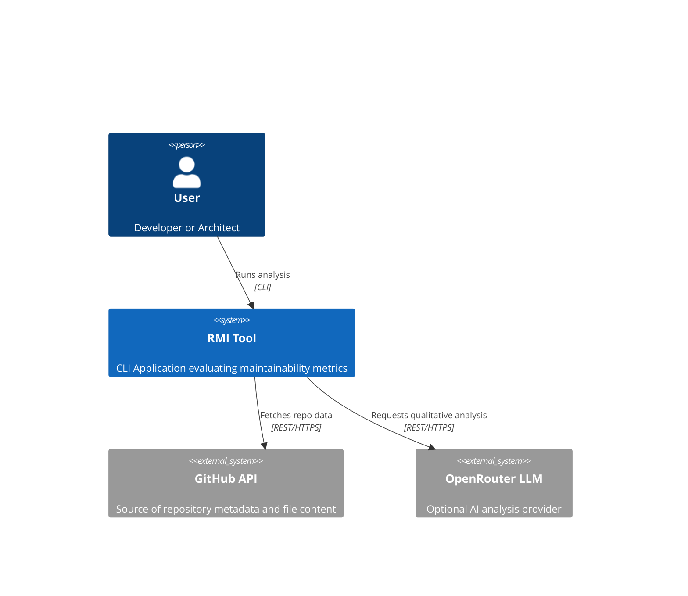
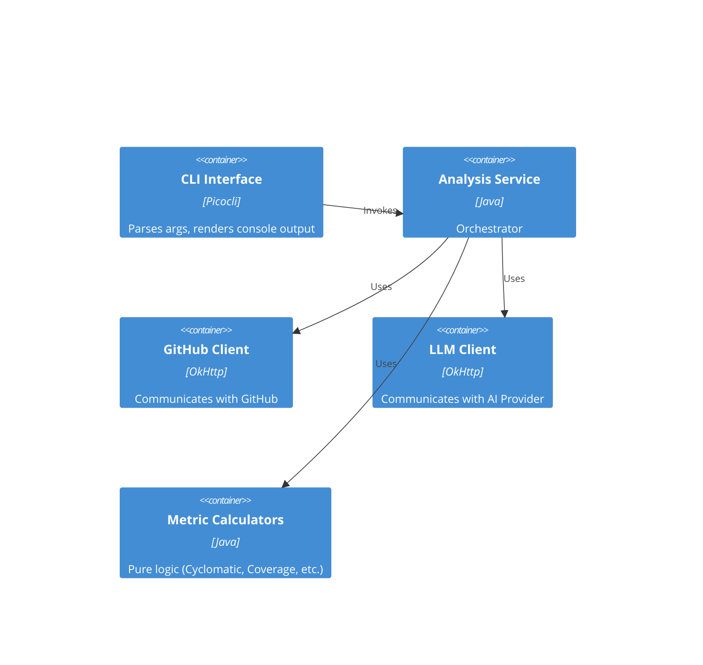

# RMI Architecture Documentation (As-Is)

## 1. Context (C4 Level 1)

The **Repository Maintainability Index (RMI)** is a Command Line Interface (CLI) tool used by Software Engineers and Tech Leads to evaluate the quality, maintainability, and health of GitHub repositories.

## 2. Container (C4 Level 2)

The RMI system is a single deployment unit (Monolithic JAR), but logically structured into distinct components.

*   **CLI Container (Java 17 / Picocli):** Entry point, parses arguments, configures dependencies.
*   **Service Layer:** Orchestrates the analysis flow.
*   **Metric Engines:** Independent calculators for specific quality attributes.
*   **External Adapters:** Clients for GitHub and OpenRouter.

## 3. Component (C4 Level 3) - Core Analysis Flow

The `AnalysisService` is the central coordinator.

1.  **Validation:** Checks API keys and repository existence.
2.  **Data Fetching:** Retrieves tree structure, recent commits, issues, and PRs via `GitHubClient`.
3.  **Metric Calculation:** Iterates through `MetricCalculator` implementations:
    *   `CodeQualityMetric`
    *   `DocumentationMetric`
    *   `ActivityMetric`
    *   `CommunityHealthMetric`
4.  **LLM Enhancement (Optional):** Sends context to `LlmClient` for qualitative summary.
5.  **Report Generation:** Formats `RepositoryReport` into Text or JSON.

## 4. Key Design Patterns
*   **Builder Pattern:** Used for `RepositoryReport`, `CommitInfo`, and configuration objects.
*   **Strategy Pattern:** Implicitly used in `MetricCalculator` interface.
*   **Dependency Injection:** Constructor-based injection used throughout the Service layer (wired manually in `Main.java` or `RmiCommand`).
*   **Immutable Objects:** Domain models are immutable to ensure thread safety (though currently single-threaded).

## 5. Deployment
*   **Packaging:** Uber-JAR (via Maven Shade Plugin).
*   **Distribution:** Docker Container (`eclipse-temurin:17-jdk-alpine`).
*   **Configuration:** Environment variables (`.env`).
